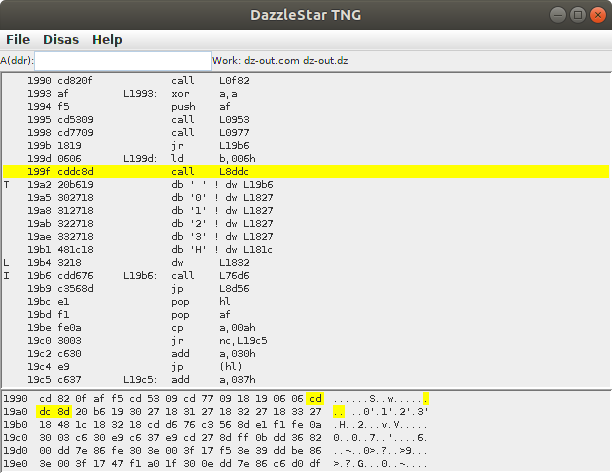
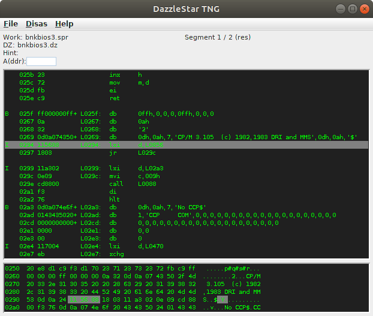

# DazzleStar TNG
## DazzleStar The Next Generation
## Interactive Z80 Disassembler

Supports binary (.COM, etc at any ORG) files plus PRL, SPR, and REL.
Uses relocation information, when available, to pre-load symbol tables
and identify labels vs. constants.

[See Help file](http://sebhc.durgadas.com/dazzlestar/dzhelp.html)

