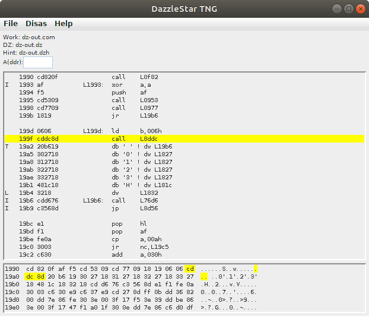

# DazzleStar TNG
## DazzleStar The Next Generation
## Interactive Z80 Disassembler

Supports binary (.COM, etc at any ORG) files plus HEX, PRL, SPR, and REL.
Uses relocation information, when available, to pre-load symbol tables
and identify labels vs. constants.

It includes a "code scanner" feature where you specifiy an "entry point"
and it will trace through all code paths and identify sections of the program
that are not executed (possible data). This is an iterative process, but still
allows one to quickly separate data regions from instructions.

The output mnemonics may be set to either
MAC80 (default, CP/M MAC/RMAC with Z80.LIB macros),
or Zilog.

If you encounter problems, or have requests for enhancement, please open
an issue on this github project.

[See Help file](http://sebhc.durgadas.com/dazzlestar/dzhelp.html)

